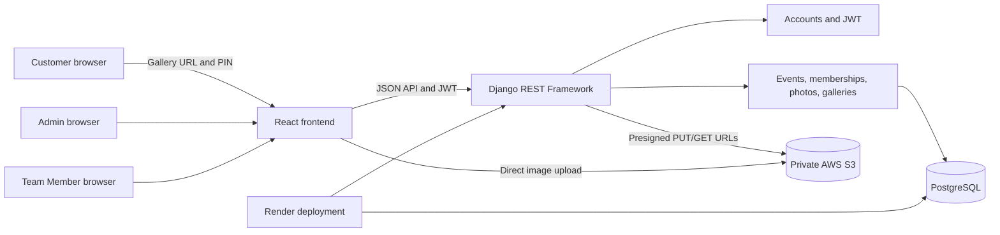
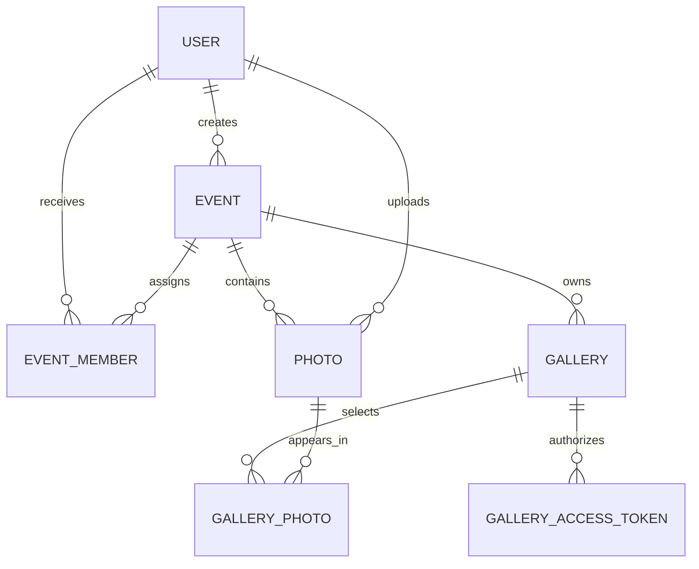

# Photo Sharing Platform

A secure event-photo workflow for photographers, production teams, and customers. An Admin creates an event, assigns Team Members, collects photos in private S3 storage, curates a selection, and publishes a PIN-protected customer gallery. Customers do not create accounts: they receive an opaque gallery URL and a PIN.

## Project Overview

The platform follows this workflow:

1. An Admin signs in and creates an event.
2. The Admin creates Team Member accounts and assigns them to the event.
3. Admins and assigned Team Members create photo metadata and upload image bytes directly to S3 using short-lived presigned URLs.
4. The backend verifies the uploaded object before it is treated as ready.
5. The Admin creates a draft gallery, selects photos from the owning event, and publishes it.
6. The backend generates an unpredictable public identifier and stores only a hash of the gallery PIN.
7. A customer opens the gallery URL, submits the PIN, receives a short-lived gallery-scoped token, and browses only published selections.

## Features

### Admin

- Sign in with an email and password.
- Create and update owned events.
- Create Team Member accounts.
- Assign Team Members to owned events.
- Upload and review event photo metadata.
- Create draft galleries with hashed PINs.
- Select and deselect photos from the owning event.
- Publish a non-empty gallery.
- Share the public gallery URL and customer PIN out of band.

### Team Member

- Sign in with an Admin-created account.
- View assigned events only.
- Upload photos to assigned events.
- View metadata for their own event uploads according to backend permissions.
- Cannot create events, manage galleries, publish galleries, or assign other users.

### Customer

- No account required.
- Open an opaque gallery URL.
- Submit a gallery PIN.
- Receive temporary access to one published gallery.
- Browse responsive photo grids and temporary photo URLs.
- Never see draft galleries, unpublished selections, PIN hashes, storage keys, or Admin controls.

## Technology Stack

- **Frontend:** React, JavaScript, React Router, Vite, responsive CSS.
- **Backend:** Python, Django, Django REST Framework.
- **Authentication:** JWT access and refresh tokens with rotation and blacklist support.
- **Database:** PostgreSQL in development/production; isolated SQLite settings are available for tests.
- **Object storage:** Private AWS S3 objects accessed through presigned URLs.
- **Deployment:** Render web service plus managed PostgreSQL and AWS S3.

## Architecture



The backend is authoritative for roles, event ownership, photo visibility, gallery publication, and PIN validation. The frontend route guard exists only to improve navigation and cannot grant access.

## Database Design

All application primary keys are UUIDs. Django migrations define the schema.

### `accounts_user`

The custom user entity. It stores name, normalized email, password hash, active state, role, and timestamps. Roles are `ADMIN` and `TEAM_MEMBER`. Passwords are handled by Django’s password hashing APIs and are never returned by serializers.

### `events_event`

An event owned by one Admin through `created_by`. An Admin can see and manage owned events. Team Members can see events through their memberships.

### `events_eventmember`

The assignment join entity between `Event` and `User`. It links active Team Members to events and enforces a unique `(event, user)` relationship. Event deletion cascades to assignments.

### `photos_photo`

Photo metadata: event, uploader, original filename, file size, unique S3 storage key, and creation time. Binary image content is not stored in PostgreSQL. Event deletion cascades to photo metadata while uploader deletion is protected.

### `galleries_gallery`

An event-owned gallery with an opaque public identifier, hashed PIN, publication flag, and publication timestamp. A database constraint keeps `published` and `published_at` consistent.

### `galleries_galleryphoto`

The gallery selection join entity. It links a gallery to a photo and enforces unique `(gallery, photo)` selection. Application validation also requires the photo and gallery to belong to the same event.

### `galleries_galleryaccesstoken`

Stores hashes of public gallery access tokens and the gallery they belong to. The current public token implementation uses short-lived signed JWTs; this table supports hashed token records where applicable.

Relationships:



## API Design

Base URL: `/api/v1/`. Successful responses use `{ "data": ... }`; errors use `{ "code", "message", "details" }`.

### Authentication: `/auth/`

- `POST /auth/login/`: authenticate an active Admin or Team Member.
- `POST /auth/refresh/`: rotate a refresh token and issue a new access token.
- `POST /auth/logout/`: blacklist a refresh token.
- `GET /auth/me/`: return the authenticated profile.
- `POST /auth/register/`: local-development-only Admin bootstrap when explicitly enabled.
- `POST /auth/team-members/`: Admin creates a Team Member account.

### Events: `/events/`

- List visible events.
- Admin-only event creation.
- Event detail and Admin-owned updates.
- View event assignments.
- Admin-only Team Member assignment.

### Photos: `/photos/`

- List authorized event photo metadata with pagination.
- Create photo metadata and receive a presigned S3 upload URL.
- Complete an upload after S3 transfer and verify the object.
- Request temporary download URLs for authorized photos.

### Galleries: `/galleries/`

- Admin-only gallery creation and listing for owned events.
- Retrieve an owned gallery and its selected photos.
- Select or deselect photos before publication.
- Publish a non-empty gallery; published galleries are immutable.

### Customer galleries: `/public/galleries/`

- Verify a PIN for a published public identifier.
- Retrieve selected photos for a valid gallery token.
- Retrieve a temporary URL for a selected published photo.

See [backend/API.md](backend/API.md) for the endpoint table and access boundaries.

## Authentication and Authorization

### Admin

Admin accounts are the event owners. They can manage owned events, assign Team Members, upload photos, and manage galleries for owned events. Public Admin registration is disabled in production.

### Team Member

Team Members are created by an Admin and receive access only through explicit event assignments. They cannot create events or manage publication workflows.

### Customer

Customers have no platform account. They authenticate to one published gallery with its PIN. The backend issues a short-lived gallery-scoped token and validates that token against the requested gallery on every protected customer request.

### Permission model

Authorization is enforced on the backend using DRF permission classes and ownership-filtered querysets. UUIDs are identifiers, not permissions: knowing an event, photo, or gallery UUID does not grant access.

## Photo Storage

Images are stored in private AWS S3 rather than PostgreSQL because S3 is designed for large binary objects, scales independently from relational metadata, supports lifecycle and durability controls, and allows temporary presigned transfer URLs. PostgreSQL stores only metadata and the unique storage key.

The upload lifecycle is:

1. The backend validates filename, extension, declared MIME type, and size.
2. The backend creates metadata and a short-lived presigned PUT URL.
3. The browser uploads directly to S3.
4. The backend verifies object size, S3 content type, and actual supported image bytes before completion.
5. Downloads use short-lived presigned GET URLs.

## Local Development

### Prerequisites

- Git
- Python 3.14 or a supported Python version for the pinned dependencies
- Node.js 20+
- PostgreSQL 14+
- AWS S3 credentials and a private bucket for real photo upload/download testing

### Initial setup

From PowerShell at the repository root:

```powershell
git clone <repository-url>
cd Photo_sharing

python -m venv backend\.venv
.\backend\.venv\Scripts\Activate.ps1
python -m pip install --upgrade pip
python -m pip install -r backend\requirements.txt

npm install --prefix frontend
Copy-Item .env.example backend\.env
Copy-Item frontend\.env.example frontend\.env.local
```

Edit `backend/.env` with local PostgreSQL values. Do not commit it.

## Environment Variables

Use [`.env.example`](.env.example) as the safe template. It contains placeholders only.

Important variables:

- `DJANGO_SETTINGS_MODULE`: `config.settings.development` locally, `config.settings.production` on Render.
- `DJANGO_SECRET_KEY`: long random secret; required in production.
- `DJANGO_DEBUG`: `True` only locally; `False` in production.
- `DJANGO_ALLOWED_HOSTS`: allowed backend hostnames.
- `POSTGRES_DB`, `POSTGRES_USER`, `POSTGRES_PASSWORD`, `POSTGRES_HOST`, `POSTGRES_PORT`: PostgreSQL connection values.
- `CORS_ALLOWED_ORIGINS`: exact frontend origins, never `*` with credentials.
- `CSRF_TRUSTED_ORIGINS`: trusted HTTPS origins if cookie-authenticated Django views are added.
- `REDIS_URL`: shared Redis endpoint for production rate limiting.
- `AWS_ACCESS_KEY_ID`, `AWS_SECRET_ACCESS_KEY`, `AWS_STORAGE_BUCKET_NAME`, `AWS_REGION`: private S3 configuration.
- `ALLOW_PUBLIC_ADMIN_REGISTRATION`: `False` by default; only enable for local bootstrap.
- `TRUST_PROXY_HEADERS`: enable only when the deployment proxy is trusted and configured.
- `VITE_API_BASE_URL`: frontend API base, normally `/api/v1`.

Never put production secrets in React source, Git, or `frontend/.env` variables that are exposed to the browser.

## Database Setup

Create a local database and user using PostgreSQL:

```sql
CREATE USER photo_sharing_app WITH PASSWORD 'replace-with-a-local-password';
CREATE DATABASE photo_sharing_db OWNER photo_sharing_app;
```

Set matching values in `backend/.env`, then run:

```powershell
cd D:\Photo_sharing
$env:DJANGO_SETTINGS_MODULE = 'config.settings.development'
backend\.venv\Scripts\python.exe backend\manage.py migrate
backend\.venv\Scripts\python.exe backend\manage.py check
```

For isolated tests that do not require PostgreSQL credentials:

```powershell
$env:DJANGO_SETTINGS_MODULE = 'config.settings.test'
backend\.venv\Scripts\python.exe backend\manage.py test accounts events photos galleries core
```

## Running Backend

```powershell
cd D:\Photo_sharing
$env:DJANGO_SETTINGS_MODULE = 'config.settings.development'
backend\.venv\Scripts\python.exe backend\manage.py runserver 127.0.0.1:8000
```

Health endpoint: `http://127.0.0.1:8000/api/v1/health/`.

## Running Frontend

In a second terminal:

```powershell
cd D:\Photo_sharing
npm.cmd run dev --prefix frontend
```

Open `http://localhost:5173/`.

## Testing

Backend checks and tests:

```powershell
$env:DJANGO_SETTINGS_MODULE = 'config.settings.test'
backend\.venv\Scripts\python.exe backend\manage.py check
backend\.venv\Scripts\python.exe backend\manage.py test accounts events photos galleries core --verbosity 1
```

Production configuration check:

```powershell
$env:DJANGO_SETTINGS_MODULE = 'config.settings.production'
backend\.venv\Scripts\python.exe backend\manage.py check --deploy
```

Frontend build:

```powershell
npm.cmd run build --prefix frontend
```

The test suite covers password hashing, login/logout, role and ownership boundaries, gallery publication and PIN access, upload metadata validation, S3 service behavior, and malformed uploaded-image rejection.

## Deployment

### Render backend service

Configure a Render web service with:

- **Root directory:** `backend`
- **Build command:** `pip install -r requirements.txt && python manage.py migrate && python manage.py collectstatic --noinput`
- **Start command:** `gunicorn config.wsgi:application --bind 0.0.0.0:$PORT`
- **Environment:** `DJANGO_SETTINGS_MODULE=config.settings.production`

Set all production environment variables through Render’s secret environment configuration. Use a managed PostgreSQL database, private S3 bucket, least-privilege IAM credentials, and a shared Redis service for distributed PIN throttling.

### Render frontend service

Configure a static site with:

- **Root directory:** `frontend`
- **Build command:** `npm ci && npm run build`
- **Publish directory:** `dist`
- **Environment:** `VITE_API_BASE_URL=https://<backend-host>/api/v1`

Configure SPA fallback routing so browser refreshes on client routes serve `index.html`. Add the frontend origin to backend `CORS_ALLOWED_ORIGINS`.

## Demo Credentials

Do not commit real credentials. Use placeholders in documentation and deployment configuration:

```text
Admin email: <admin-email>
Admin password: <admin-password>
Team Member email: <team-member-email>
Team Member password: <team-member-password>
```

For local development only, enable `ALLOW_PUBLIC_ADMIN_REGISTRATION=True`, create the first Admin, then disable the setting before deployment.

## Demo Gallery

```text
Live application URL: <frontend-live-url>
Gallery URL: <public-gallery-url>
Gallery PIN: <gallery-pin-shared-out-of-band>
```

Never place a real PIN in Git, frontend source, screenshots, or public documentation.

## Security

- Django password hashing protects account passwords.
- JWT access tokens are short-lived; refresh tokens rotate and are blacklisted on logout.
- Frontend sessions use tab-scoped storage and backend logout revocation.
- Backend permissions enforce roles, event ownership, membership, uploader visibility, gallery ownership, and publication state.
- Gallery PINs are hashed and rate-limited; public access tokens are short-lived and gallery-scoped.
- S3 objects remain private and are accessed with short-lived presigned URLs.
- Uploads enforce size, extension, declared MIME, S3 metadata, and actual image-content validation.
- Storage keys are generated by the backend and are not returned in public photo metadata.
- Production settings disable DEBUG, require a secret key, enable HTTPS redirect, HSTS, `nosniff`, strict referrer policy, and clickjacking protection.
- CORS is origin allowlisted and secrets are environment-managed.
- API error responses avoid returning internal exception text.

Previously exposed credentials must be rotated immediately if they were ever used outside local development or committed to repository history.

## Known Limitations

- Production rate limiting requires a shared Redis backend; local-memory cache is suitable only for development or single-process use.
- Actual S3 upload/download testing requires valid AWS configuration and a private bucket.
- Team Member creation is available through the backend Admin endpoint; the current frontend focuses on assigning existing Team Members to events.
- The frontend does not yet provide a full image thumbnail preview for every Admin photo-management tile; photo delivery itself uses presigned URLs.
- Public Admin registration is intentionally disabled in production and requires an explicit bootstrap process.

## Future Improvements

- Add a dedicated production bootstrap/invitation workflow for the first Admin.
- Add background image processing and thumbnail generation.
- Add automated dependency, secret, and container scanning to CI.
- Add end-to-end tests against staging PostgreSQL, Redis, S3, and Render deployments.

## Additional Documentation

- [API reference](backend/API.md)
- [Database schema notes](backend/SCHEMA.md)
- [Environment template](.env.example)
# photo_sharing_platfrom

